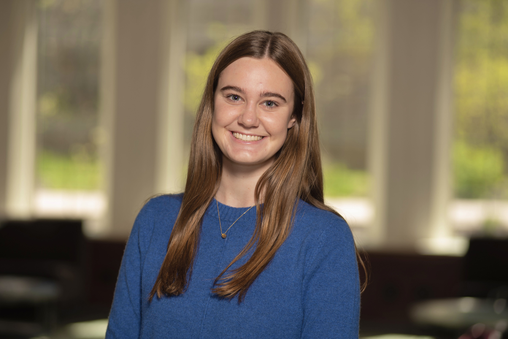

  
  

  <h1>About</h1>

  
Hi! I'm a junior at the University of Notre Dame studying Computer Science with a minor in Engineering Corporate Practice. Originally from the Bay Area, CA, I love trips to the coast, colorful sunsets, photography, beach volleyball, and golf. I'm passionate about using technology and innovation as a force for good.

  
I spent this past summer in Lyon, France researching AI transformer neural network acceleration through emerging in-memory computing technologies. I am continuing this research by co-authoring a paper that introduces the 1FeFET-1C model and explores how its multi-modality storage solutions improve energy efficiency and reduce latency of AI workloads. This fall, I am expanding my AI research to Recommendation Systems as well. My technical knowledge is complemented by my business minor and leadership experience with human-centered design thinking and innovation. I am a team collaborator who can drive decisions and solve problems with creativity and empathy.

  <h1>Experiences</h1>
  
<a href="https://www.linkedin.com/posts/molly-sullivan-nd_this-summer-i-had-the-incredible-opportunity-activity-7242912468702781440-iCt3?utm_source=share&utm_medium=member_desktop">2024 AI Transformer Research in Lyon, France</a>

  
<a href="https://www.linkedin.com/feed/update/urn:li:activity:7092565379205492736/">Summer 2023 Drone Response Research</a>

  
<a href="https://theshirt.nd.edu/">The Shirt Project Vice President</a>

  
<a href="https://www.designforamerica.org/">ND Design For America Co-President</a>

  
...

  <h1>Contact</h1>
  
msulli52@nd.edu

  
<a href="https://www.linkedin.com/in/molly-sullivan-nd/">LinkedIn</a>

  
<a href="https://drive.google.com/file/d/1XxmLkWRZC724CebOtuBex3eOh8BkGRbR/view?usp=sharing">Resume</a>

  
<a href="https://github.com/msulli52">GitHub</a>

